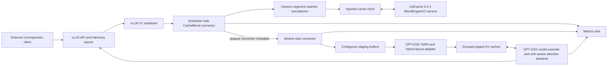

# Architecture and exact integration boundary

## Status

This document describes a design, not a completed connector. The source audit
establishes this boundary:

- Connector discovery/loading: **public vLLM API, out of tree, no patch**.
- Position-independent matching and fingerprints: **out of tree**.
- The synchronous transfer proof with 100% recomputation: **out of tree, no
  patch**.
- GPT-OSS YaRN key correction and group-aware staging/scatter: **out of tree**.
- Selective non-prefix recomputation: **not expressible by the connector API
  alone**. First exhaust a registered GPT-OSS model override and custom
  sink-aware attention backend. A pinned vLLM patch is only a gated fallback.

The evidence behind each statement is in [the pinned source audit](source-audit.md).

## Supported envelope

The only immediate target is:

| Property | Required value |
|---|---|
| Model | `openai/gpt-oss-20b`; exact local model revision/digest must be recorded before persistent KV reuse |
| Model topology | 24 layers; even layers use 128-token sliding attention, odd layers full attention; 64 Q heads, 8 KV heads, head dimension 64; learned sinks; 32 experts with 4 active |
| Context and position encoding | 131,072 tokens, GPT-OSS YaRN RoPE configuration from the loaded model |
| vLLM | `0.19.1`, source commit `b1388b1fbf5aaef47937fabe98931211684666a6` |
| LMCache | `0.4.3`, source commit `7f326118a2f1afc7801988dd02e3055bdf21ef6b` |
| PyTorch / CUDA | `2.10.0+cu128` / runtime `12.8` |
| Device | one `NVIDIA A100-SXM4-80GB` initially; TP=1 |
| API | vLLM `/v1/responses`, including Harmony reasoning and tool calls |

The model ID, context length, and Responses/function-calling capabilities agree
with the [official GPT-OSS-20B model documentation](https://developers.openai.com/api/docs/models/gpt-oss-20b).
None of the generic interfaces below expands this support envelope.

## System boundary



The RAG client remains outside this repository and knows none of the plugin's
Python types. LMCache is behind an injected storage/transport interface; its
multiprocess blend APIs are version-pinned internals, not allowed to leak into
the generic planner.

## Components

### Generic planner layer

The planner operates on token IDs and injected interfaces, with no vLLM tensor
imports. Its responsibilities are:

- deterministic segmentation and position-independent candidate lookup;
- strong candidate verification;
- source-to-destination token-range mapping;
- per-layer/per-group load intent;
- rejection reasons and fail-closed compatibility decisions;
- a recomputation policy that initially selects every scheduled token;
- immutable plan metadata consumed by the worker.

Planned interfaces are conceptually `Segmenter`, `CacheIndex`, `CacheTransport`,
`BlendPlanner`, `RecomputePolicy`, and `MetricsSink`. CPU tests use fakes for
each boundary.

### Version-scoped connector layer

`cacheblend_gpt_oss.vllm_compat.v0_19_1` will contain the only imports of vLLM
internals. `GptOssCacheBlendConnector` will derive from both
`KVConnectorBase_V1` and `SupportsHMA` and will have the current constructor:

```python
def __init__(self, vllm_config, role, kv_cache_config): ...
```

The scheduler-role object owns request planning and block-allocation metadata.
The worker-role object owns registered cache tensors, staging buffers,
group/layer scatter-gather, transfer synchronization, error reporting, and
writeback. The two roles communicate only through vLLM's opaque
`KVConnectorMetadata` and worker output contracts.

The module-path loader is sufficient for this connector. A
`vllm.general_plugins` entry point is needed later only to register the custom
GPT-OSS model/backend used by selective recomputation.

### GPT-OSS adapter

The adapter is model-specific and validates the loaded configuration rather
than inferring generic support. It owns:

- the exact post-RoPE key correction for GPT-OSS's YaRN implementation;
- layer-name to `KVCacheGroup`/physical-layout mapping;
- separate handling of full and sliding attention;
- sink-aware backend validation and forwarding;
- recomputed-row selection/merge after the selective milestone opens;
- preservation of the output tensor and sampling indices expected by the
  pinned model runner.

MoE weights and routing are not cache data. At selective ratios below 100%, the
model adapter must run GPT-OSS's ordinary RMSNorm, attention, residual, router,
and MXFP4 expert path for every row selected for recomputation.

### LMCache transport adapter

LMCache 0.4.3 `BlendEngineV2` can provide candidate subsequence matching,
storage, CUDA IPC registration, and contiguous transfer. The adapter wraps its
`MessageQueueClient`, `IPCCacheEngineKey`, `CBMatchResult`, and CUDA IPC types
behind this project's transport protocol.

The server's `[2, layers, tokens, dimension]` staging layout is not vLLM's paged
hybrid layout. The worker must validate the returned range, then gather/scatter
tokens into the correct layer tensor and cache-group slot mapping. No LMCache
code is allowed to guess vLLM group IDs.

The transport may be replaced by an in-memory fake or a local file fixture in
CPU tests. That dependency injection is also the escape hatch if the pinned
LMCache server protocol proves unsuitable.

## Exact request lifecycle

The connector follows the pinned vLLM path without mutating scheduler output:

1. The OpenAI server tokenizes the complete Harmony-formatted request. The
   connector sees vLLM's tokenized `Request`; `/v1/responses` is unchanged.
2. `Scheduler.schedule` asks the local KV manager for prefix blocks, then calls
   `get_num_new_matched_tokens`.
3. In the 100% phase, the connector plans non-prefix candidates but returns
   `(0, False)`. vLLM therefore regards none of them as already computed and
   schedules ordinary full prefill.
4. `KVCacheManager.allocate_slots` allocates every destination group. The
   scheduler then calls `update_state_after_alloc` with grouped `KVCacheBlocks`
   and zero external tokens. This is where the plan becomes bound to actual
   destination blocks.
5. `build_connector_meta` serializes immutable ranges, group mappings, cache
   identity, expected digests, and metrics correlation into opaque metadata.
6. The worker model runner prepares ordinary contiguous input IDs, positions,
   slot mappings, and attention metadata, then binds connector metadata.
7. `start_load_kv` performs lookup/transfer. For the 100% milestone it must
   finish synchronously before the first model layer because stock Triton writes
   cache slots before the decorated per-layer wait.
8. The worker verifies full tokens/digests and layout, optionally corrects
   shifted post-RoPE keys once that milestone is enabled, and scatters accepted
   K/V into destination groups. A failed check rejects the range; it never
   becomes usable cache state.
9. Stock GPT-OSS processes the full prompt. At 100% recomputation every loaded
   slot is overwritten with newly computed K/V before it can affect output.
10. `save_kv_layer` captures newly computed reusable ranges. Sliding-layer KV is
    saved during each prefill step because old window blocks can be reclaimed
    before request completion.
11. Worker completion, load errors, and connector metrics return in
    `KVConnectorOutput`; scheduler state is advanced normally.
12. On completion, `request_finished_all_groups` receives every hybrid block
    table and releases connector state. vLLM produces an ordinary Harmony
    response.

This first path demonstrates transport, not acceleration. Its required metrics
show positive found/loaded counts, full recomputed count, and zero effective
saved-prefill fraction.

## Position-independent segmentation and identity

### Segmentation policies

The API cannot rely on a client-provided document ID or segment annotation.
Segmentation is server-side and injected:

- The first moved-document integration fixture uses deterministic configured
  delimiter token sequences. Moving the delimited document changes absolute
  positions but not its segment identity.
- The transparent workload path uses fixed-size complete chunks indexed at
  storage time and a rolling query window at every token offset. This preserves
  matches when a document moves by a non-chunk-aligned amount.
- Content-defined chunking may be evaluated later, but is not needed for the
  first correctness proof.

The RAG workload serializes changing rank/score/JSON wrappers around stable
snippets. Matchers should find the exact snippet token span inside the whole
prompt rather than fingerprint those wrappers.

### Fingerprints and cache namespace

A segment fingerprint excludes absolute prompt position and includes a
domain-separated, canonical encoding of:

- the exact ordered token IDs and token count;
- segmentation algorithm and schema version;
- tokenizer identity/revision and special-token configuration.

Use a cryptographic digest (initially SHA-256) for persistent identity. LMCache's
rolling hash is candidate generation only. A hit is accepted only if the strong
digest and exact stored token IDs both match.

The surrounding cache namespace, validated before lookup, includes:

- model ID plus immutable model artifact/revision digest;
- vLLM/LMCache/plugin compatibility versions;
- tensor-parallel world/rank and pipeline configuration;
- activation and KV dtypes, cache block size, tensor layout, and group schema;
- all 24 layer names and attention specs;
- complete GPT-OSS RoPE/YaRN parameters and head layout;
- adapter/storage schema versions.

The cache record stores source absolute positions separately. Position is
needed to correct keys, but must not affect whether the same token segment is
found at a new destination.

A token match does not make deeper-layer KV context independent. Hidden states
and K/V depend on preceding context, including full-attention layers. CacheBlend
is approximate when cached rows are not recomputed. The 100% phase remains exact
because it overwrites every candidate; lower ratios must report measured error.

## GPT-OSS key correction

Pinned GPT-OSS applies rotary embedding before K reaches generic attention, so
stored keys are post-RoPE and values are not position encoded. Let
`K_s = m R(s) K_raw`, where `R` uses the exact GPT-OSS YaRN blended inverse
frequencies and NeoX pairing, and `m` is YaRN's magnitude scale. The destination
key is:

```text
K_t = R(t - s) K_s
```

The delta rotation is the unit rotation built from the pinned YaRN frequencies;
it must not apply `m` a second time. Implement the trig path in float32, then
cast to the validated KV dtype. V is copied unchanged.

The adapter must not approximate this with generic base-theta RoPE. CPU tests
compare shift correction with direct old/new GPT-OSS YaRN application over
positions below, across, and far beyond the original context boundary. GPU
tests compare corrected K tensors and downstream layer outputs against fresh
prefill.

## Hybrid groups, sliding attention, and sinks

- The launch must explicitly retain the hybrid allocator with
  `--no-disable-hybrid-kv-cache-manager`. Startup rejects a disabled allocator.
- Never assume one block table or one uniform tensor. Bind cache groups by their
  `KVCacheGroupSpec` and layer-name membership.
- Require the expected alternating layer specs: even layers have window 128;
  odd layers are full attention. Any missing/duplicate layer mapping is fatal.
- Full and sliding layers get independent source/destination slot plans and
  metrics. Sliding KV is saved before out-of-window block reclamation.
- Learned sinks remain per-head model parameters passed into attention. They are
  neither included in segment records nor shifted. The custom backend must
  advertise sink support and pass the exact tensor into its logits/softmax path.
- The initial A100 path validates the sink-capable Triton backend and rejects
  FlashAttention or an unrecognized backend.

## Selective-recomputation data plane

After the 100%, correction, hybrid, and sink gates pass, the first no-patch
experiment is:

1. The connector publishes the immutable per-forward plan to a worker-local,
   lifetime-bounded context.
2. A `vllm.general_plugins` entry point lazily overrides only
   `GptOssForCausalLM` through `ModelRegistry.register_model`.
3. The override preserves the pinned model interface and full-shaped output but
   computes selected hidden-state rows after the configured check layer. It
   scatters rows back where the model runner expects logits indices.
4. A registered `CUSTOM` backend starts from the sink-capable Triton semantics,
   waits for loaded data before overlapping writes, recomputes selected Q/K/V,
   and merges those rows with accepted corrected K/V.
5. Run eager, single-request, non-speculative execution first. Compilation,
   CUDA graphs, batching, and kernel optimization remain disabled until the
   numerical path is understood.

The scheduler continues to schedule the full prompt in this experiment. Saved
work is measured inside the model as skipped token-layer computation, not
misreported as vLLM prefix-cached tokens. This sacrifices admission-control
benefit but can establish whether an entirely out-of-tree data plane is viable.

If the model runner requires every intermediate row to be materially computed,
if sampling/logit indices cannot be preserved with a full-shaped scatter, or if
the stock slot-mapping contract cannot address selected writes, stop and design
a minimal pinned patch. Do not monkey-patch functions at import time.

## Public extension points versus patch boundary

| Need | Boundary for this project | Patch now? |
|---|---|---|
| Load scheduler/worker connector | `kv_connector_module_path` + `KVConnectorBase_V1` | No |
| Carry non-prefix plan while scheduling full prompt | Opaque `KVConnectorMetadata` | No |
| Segment, fingerprint, verify, and query LMCache | Project-owned interfaces; pinned LMCache protocol adapter | No |
| Register worker cache tensors and layer load/save | V1 worker connector hooks | No |
| Correct YaRN-shifted K and scatter group slots | GPT-OSS adapter in worker connector | No |
| Select rows while keeping full scheduler accounting | External model override + `CUSTOM` backend spike | Not yet |
| Native arbitrary-position scheduler accounting | No public connector representation | Yes, only if later required |
| Keep stock model/backend but skip arbitrary rows | No public hook | Yes |
| Expose aggregate connector metrics | Connector stats plus plugin Prometheus collector | No |
| Add new per-response metric JSON fields | No stable public boundary established in audit | Defer; prefer Prometheus/artifacts first |

Any future patch is kept separate from package code, pinned to the audited
commit, contains an upstream-file/line manifest, and is tested to refuse every
other vLLM version.

## Startup and per-request fail-closed policy

Before enabling reuse, startup validates:

- exact package versions, CUDA runtime, GPU name/capability, and TP=1;
- `VLLM_USE_V2_MODEL_RUNNER=0` until that optional runner is separately audited;
- the exact model revision/digest and the expected GPT-OSS architectural fields;
- YaRN parameters, head layout, activation/KV dtype, block size, and all cache
  groups/layers;
- hybrid allocator enabled and connector `SupportsHMA` behavior;
- sink-capable supported backend;
- no speculative decoding, pipeline parallelism, LoRA, DBO, or other untested
  execution feature in the first milestones;
- identical cache namespace and record schema at the LMCache service.

Per request, a lookup timeout, missing range, digest/token mismatch, stale model
namespace, incomplete layer/group coverage, invalid slot mapping, transfer
error, or correction error rejects the candidate. Depending on the explicitly
configured policy, the request either performs full prefill or fails visibly.
There is no partial silent acceptance.

Prefix caching is disabled during isolated CacheBlend correctness runs. It is
re-enabled only for the separate prefix baseline and the explicit interaction
test.

## Metrics contract

The initial stable metrics are Prometheus counters/histograms and structured
test artifacts. Names are provisional until the first implementation, but their
semantics are fixed:

| Metric | Meaning |
|---|---|
| `cacheblend_reusable_document_tokens_requested_total` | Tokens in planner-designated reusable segments |
| `cacheblend_kv_tokens_found_total` | Tokens returned as storage/matcher candidates before final acceptance |
| `cacheblend_kv_tokens_loaded_total` | Fully verified tokens transferred into staging/destination KV |
| `cacheblend_kv_tokens_rejected_total` | Candidate tokens rejected, with a bounded reason label |
| `cacheblend_tokens_recomputed_total` | Prompt rows actually recomputed by the model path |
| `cacheblend_document_hit_fraction` | Fully verified requested segments divided by requested segments |
| `cacheblend_token_hit_fraction` | Verified loaded reusable tokens divided by requested reusable tokens |
| `cacheblend_effective_saved_prefill_fraction` | Verified reusable prompt rows not recomputed divided by baseline prompt rows; zero in the 100% phase |
| `cacheblend_lookup_seconds` | Scheduler-side matching/storage lookup wall time |
| `cacheblend_transfer_seconds` | Accepted KV transport plus staging time |
| `cacheblend_position_correction_seconds` | YaRN shifted-key correction time |
| `cacheblend_selective_recomputation_seconds` | Model time spent on selected rows, separately from planning/transfer |
| vLLM TTFT/prefill metrics | Server-measured TTFT and total prefill latency; the non-streaming client cannot infer TTFT |

Correctness artifacts record baseline and CacheBlend logits/hidden-state dtype,
maximum and mean absolute error, relative error, top-token agreement, selected
layer/group, seed, full runtime/config identity, and recomputation ratio. They
are not high-cardinality Prometheus labels.

At the request boundary, `found >= loaded`, `found - loaded` reconciles with
rejections, and `effective_saved_prefill_fraction == 0` whenever recomputation
is 100%. Violating these invariants fails the test run.

## External RAG interface

The eventual deployment remains a transparent GPT-OSS endpoint:

```text
solab-p7 RAG workflow -> configured RAG_GENERATOR_URL
                     -> solab-g3 /v1/responses
                     -> this connector inside pinned vLLM
```

The RAG repository is not imported and requires no segment annotations. Its
current full-history request and Harmony item formats remain unchanged. After
validation, its only required changes should be endpoint configuration and
experiment metadata containing at least the CacheBlend commit SHA, model
revision, serving-stack versions, connector/config digest, and deployment ID.
Those proposed changes must be documented here before separate authorization to
edit `rag-system`.
