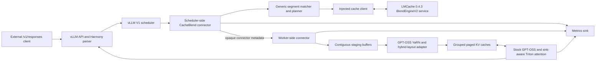

# Architecture and exact integration boundary

## Status

The pinned audit and CPU-side implementation are complete through the
instrumented 100%-recomputation data plane. No `solab-g3` result has been
provided, so this is not yet a validated GPT-OSS endpoint. The current boundary
is:

- Connector discovery/loading: **public vLLM API, out of tree, no patch**.
- Position-independent matching and fingerprints: **out of tree**.
- The synchronous 100%-recompute path: **implemented out of tree, no patch;
  GPU correctness pending**.
- GPT-OSS YaRN correction and group-aware staging/scatter: **implemented and
  CPU-fake tested; real CUDA tests pending on `solab-g3`**.
- Aggregate connector lookup/load/recompute/store metrics: **implemented through
  vLLM's public stats and Prometheus hooks; live exporter evidence pending on
  `solab-g3`**.
- Controlled benchmark evidence: **implemented as a CPU-only artifact and
  validator; all GPU arms and correctness-linked confidence intervals pending
  on `solab-g3`**.
- Selective non-prefix recomputation: **not expressible by the connector API
  alone**. First exhaust a registered GPT-OSS model override and custom
  sink-aware attention backend. The pinned follow-up audit confirms those
  registration seams are public, but also shows that split Triton cache update
  runs before the connector's per-layer wait; the custom implementation must
  mask accepted cached rows in `do_kv_cache_update`. A pinned vLLM patch is
  only a gated fallback after the M3--M5 GPU evidence.

The evidence behind each statement is in [the pinned source audit](source-audit.md).

## Supported envelope

The only immediate target is:

| Property | Required value |
|---|---|
| Model | `openai/gpt-oss-20b`; exact local model revision/digest must be recorded before persistent KV reuse |
| Model topology | 24 layers; even layers use 128-token sliding attention, odd layers full attention; 64 Q heads, 8 KV heads, head dimension 64; learned sinks; 32 experts with 4 active |
| Context and position encoding | 131,072 tokens, GPT-OSS YaRN RoPE configuration from the loaded model |
| vLLM | `0.19.1`, source commit `b1388b1fbf5aaef47937fabe98931211684666a6` |
| LMCache | `0.4.3`, source commit `7f326118a2f1afc7801988dd02e3055bdf21ef6b` |
| PyTorch / CUDA | `2.10.0+cu128` / runtime `12.8` |
| Device | one `NVIDIA A100-SXM4-80GB` initially; TP=1 |
| API | vLLM `/v1/responses`, including Harmony reasoning and tool calls |

The model ID, context length, and Responses/function-calling capabilities agree
with the [official GPT-OSS-20B model documentation](https://developers.openai.com/api/docs/models/gpt-oss-20b).
None of the generic interfaces below expands this support envelope.

## System boundary



The RAG client remains outside this repository and knows none of the plugin's
Python types. LMCache is behind an injected storage/transport interface; its
multiprocess blend APIs are version-pinned internals, not allowed to leak into
the generic planner.

## Components

### Generic planner layer

The implemented planner operates on token IDs and injected interfaces, with no
vLLM tensor imports. Its responsibilities are:

- deterministic segmentation and position-independent candidate lookup;
- strong candidate verification;
- source-to-destination token-range mapping;
- per-layer/per-group load intent;
- rejection reasons and fail-closed compatibility decisions;
- a recomputation policy that initially selects every scheduled token;
- immutable plan metadata consumed by the worker.

The package provides immutable segment/range/record types, fixed and delimiter
segmentation, SHA-256 fingerprints, exact-token verification, weighted
non-overlap matching, and injected storage boundaries. CPU tests use fakes for
each boundary. The dormant CPU-only `ForwardRowPlan` and
`ForwardRowPlanContext` also validate full-shaped per-layer row coverage for
the future M6 spike; they are not wired into vLLM. The dormant CPU-only
`CacheBlendSelectionPolicy` and its strict selection-sweep artifact format
provide deterministic lower-than-100% row plans, but remain disconnected from
vLLM until the required GPU correctness gates pass.

`vllm_compat.v0_19_1.selective_registry` adds the corresponding guarded
registration seam. It requires explicit proof of all M3--M5 prerequisites,
accepts only project-owned lazy model/backend paths, registers `CUSTOM` before
the model override, is idempotent within a process, and permanently fails
closed after a partial registration. It is intentionally not exposed as a
`vllm.general_plugins` entry point until the pinned model/backend classes and
GPU evidence exist.

The prerequisite proof now also carries five lowercase SHA-256 artifact
digests: runtime identity, repeated full-prefill tolerance, 100%-transfer
evidence, YaRN correction, and hybrid/sink behavior. Four unbound boolean
claims cannot enable registration. These digests are supplied by the eventual
solab-g3 hand-off and are never Prometheus labels or request metadata.

`SelectiveGateEvidence.from_artifact_paths` and
`scripts/hash_selective_gate_artifacts.py` bind those digests to the exact
reviewed files rather than operator-entered hex strings. The helper rejects
missing, symlinked, empty, oversized, or changing files and emits a strict
schema-1 handoff. Hashing does not approve the artifacts or enable the dormant
registrar; semantic review and all prerequisite results remain mandatory.
`SelectiveGateEvidence.verify_artifact_paths` and
`scripts/verify_selective_gate_artifacts.py` provide the corresponding
freshness check before a copied handoff is consumed. They compare the current
regular-file bytes against the bundle and reject drift, but still do not assess
GPU-result semantics.

`gpt_oss.selective_kv` is the tensor-free companion for the backend boundary:
it splits complete 24-layer hybrid spans by recompute ranges, preserves old
source positions for YaRN correction, and computes destination physical slots
for only the rows that may be written. It performs no copy and is not consumed
by the current 100%-recompute connector. Its injected `GptOssSelectiveKvUpdater`
adds the same all-preflight-before-mutation guarantee for model-produced K/V
rows and rejects non-CUDA, wrong-shape, wrong-dtype, wrong-device, or partial
cache updates. `validate_slot_mapping` additionally compares the exact
per-token physical slot vector supplied to a future pinned Triton
`do_kv_cache_update` against every layer's hybrid block spans, rejecting
padding/negative slots, wrong lengths, and cross-group mismatches before any
write. The injected updater requires one such vector for every layer, so a
caller cannot accidentally bypass the check even when all rows are selected
for recomputation. These are CPU-tested contracts, not a live attention
backend.

`gpt_oss.forward_output` guards the other half of that future M6 seam. A model
override must return the same two-dimensional hidden-state row count that
ordinary forward would produce, including runner padding, and preserve the
runner's strictly increasing logits indices. Returning only recomputed rows is
rejected before logits gathering. This contract is metadata-only and does not
enable selective execution.

`gpt_oss.selective_runtime` now provides the worker-local CPU seam that will
bind a `ForwardRowPlan` only around a future model-forward call, then validate
the full-shaped hidden output and runner logits indices before returning. It is
still dormant: no vLLM model/backend is registered, and it does not import
Torch or mutate KV tensors.

`GptOssSelectiveModelAdapter` is the model-side companion. It mirrors the
audited `GptOssForCausalLM.forward(input_ids, positions,
intermediate_tensors=None, inputs_embeds=None)` signature through an injected
callable, requires token IDs and positions, rejects prompt embeddings, and
delegates full-shaped output validation to `SelectiveForwardBridge`. This
keeps token-identity cache verification separate from any embedding path and
gives a future lazy model override one bounded call surface without importing
vLLM or Torch today.

`gpt_oss.selective_kv.GptOssSelectiveKvSession` mirrors the pinned vLLM
0.19.1 callback granularity. The stock Triton implementation invokes
`AttentionImpl.do_kv_cache_update` once for each layer immediately before that
layer's attention call, so a future custom backend cannot call the existing
all-layer writer from one callback. The session accepts layers only in
canonical order, validates each layer's `[tokens, 8, 64]` K/V rows, paged
`[blocks, 2, block, 8, 64]` cache, and physical slot mapping, and writes only
the plan's recomputed spans. It is terminal after an error or incomplete
forward; any earlier writes require discarding the request KV. This is a
CPU-tested adapter contract, not selective-serving support, and it is not
registered until the M3--M5 GPU correctness gates pass.

`gpt_oss.selective_attention.SelectiveAttentionBridge` adds the next
dependency-injected ordering contract. It invokes the per-layer KV session
before the attention callback, requires the canonical 24-layer order, passes
the exact learned sink object through unchanged, and turns either an update or
attention failure into a terminal request-discard condition. It has no vLLM or
Torch dependency and is not a custom backend implementation; the concrete
Triton subclass remains gated on real GPT-OSS GPU evidence.

`gpt_oss.selective_policy` is the dormant M7 check-layer planner. Given
verified candidate ranges and injected per-row importance scores, it chooses a
deterministic top fraction of eligible cached rows, always keeps uncached rows
and a configured suffix in recomputation, and emits a full 24-layer
`ForwardRowPlan`. The policy has no tensor or vLLM dependency and is not live;
its ratio must remain gated by measured GPU correctness. Its ratio-sweep
artifact reports deterministic recomputation work immediately, but refuses to
expose an error or latency curve until an external runner attaches finite
measurements for every ratio. The sweep itself rejects mixed prompt/check-layer,
suffix, or candidate-range contexts before exposing a work curve.

### Version-scoped connector layer

`cacheblend_gpt_oss.vllm_compat.v0_19_1` contains the only imports of vLLM
internals. `GptOssCacheBlendConnector` derives from both
`KVConnectorBase_V1` and `SupportsHMA` and will have the current constructor:

```python
def __init__(self, vllm_config, role, kv_cache_config): ...
```

The scheduler-role object owns request planning and block-allocation metadata.
The worker-role object owns registered cache tensors, staging buffers,
group/layer scatter-gather, transfer synchronization, error reporting, and
writeback. The two roles communicate only through vLLM's opaque
`KVConnectorMetadata` and worker output contracts.

The connector now composes the scheduler lookup runtime, worker bridge, CUDA
staging owner, YaRN corrector, grouped data plane, and atomic sidecar publisher.
It still returns zero externally computed tokens and therefore cannot provide
speedup. The module-path loader is sufficient for this connector. A
`vllm.general_plugins` entry point is needed later only to register the custom
GPT-OSS model/backend used by selective recomputation.

### GPT-OSS adapter

The adapter is model-specific and validates the loaded configuration rather
than inferring generic support. It owns:

- the exact post-RoPE key correction for GPT-OSS's YaRN implementation;
- layer-name to `KVCacheGroup`/physical-layout mapping;
- separate handling of full and sliding attention;
- sink-aware backend validation and forwarding;
- recomputed-row selection/merge after the selective milestone opens;
- preservation of the output tensor and sampling indices expected by the
  pinned model runner.

MoE weights and routing are not cache data. At selective ratios below 100%, the
model adapter must run GPT-OSS's ordinary RMSNorm, attention, residual, router,
and MXFP4 expert path for every row selected for recomputation.

### LMCache transport adapter

LMCache 0.4.3 `BlendEngineV2` provides candidate subsequence matching, storage,
CUDA IPC registration, and contiguous transfer. The implemented adapter wraps its
`MessageQueueClient`, `IPCCacheEngineKey`, `CBMatchResult`, and CUDA IPC types
behind this project's transport protocol.

The server's `[2, layers, tokens, dimension]` staging layout is not vLLM's paged
hybrid layout. The worker must validate the returned range, then gather/scatter
tokens into the correct layer tensor and cache-group slot mapping. No LMCache
code is allowed to guess vLLM group IDs.

The transport may be replaced by an in-memory fake or a local file fixture in
CPU tests. That dependency injection is also the escape hatch if the pinned
LMCache server protocol proves unsuitable.

#### Current storage-admission boundary

The first live transfer milestone deliberately has a narrower admission policy
than its lookup planner. LMCache 0.4.3's pinned
`CB_STORE_PRE_COMPUTED` handler receives one compact token sequence and one
staging offset, computes complete-chunk hashes from compact position zero, and
discards a partial final chunk. The worker therefore stores only complete
256-token prefix chunks (`TokenRange(0, n)`) from a fully recomputed prompt.
These semantics are defined by the pinned
[`CB_STORE_PRE_COMPUTED` wire schema](https://github.com/LMCache/LMCache/blob/7f326118a2f1afc7801988dd02e3055bdf21ef6b/lmcache/v1/multiprocess/protocols/blend.py#L51-L66)
and
[`BlendEngineV2.cb_store_pre_computed`](https://github.com/LMCache/LMCache/blob/7f326118a2f1afc7801988dd02e3055bdf21ef6b/lmcache/v1/multiprocess/blend_server_v2.py#L534-L595).
This is sufficient for the first source-document fixture, where the source
prompt is exactly one or more reusable documents, and it is fail-closed for
short or chunked-prefill requests.

The lookup path is broader: rolling windows and absolute source ranges can
identify a document at an arbitrary destination position. That does **not**
mean an arbitrary document embedded in a larger source prompt is currently
persisted as an independent LMCache record. The generic planner can represent
such a segment, but wiring it into production admission requires a later
per-range gather/store plan (including compact staging offsets, one or more
LMCache store calls, absolute source-position sidecars, and atomic publication).
Until that work is separately implemented and tested, the connector must not
claim arbitrary embedded-document persistence or infer it from a successful
lookup.

## Exact request lifecycle

The connector follows the pinned vLLM path without mutating scheduler output:

1. The OpenAI server tokenizes the complete Harmony-formatted request. The
   connector sees vLLM's tokenized `Request`; `/v1/responses` is unchanged.
2. `Scheduler.schedule` asks the local KV manager for prefix blocks, then calls
   `get_num_new_matched_tokens`.
3. In the 100% phase, the connector plans non-prefix candidates but returns
   `(0, False)`. vLLM therefore regards none of them as already computed and
   schedules ordinary full prefill.
4. `KVCacheManager.allocate_slots` allocates every destination group. The
   scheduler then calls `update_state_after_alloc` with grouped `KVCacheBlocks`
   and zero external tokens. This is where the plan becomes bound to actual
   destination blocks.
5. `build_connector_meta` serializes immutable ranges, group mappings, cache
   identity, expected digests, and identifier-free lookup observations into
   opaque metadata.
6. The worker model runner prepares ordinary contiguous input IDs, positions,
   slot mappings, and attention metadata, then binds connector metadata.
7. `start_load_kv` performs the already-planned transfer. Lookup happened on
   the scheduler. Transfer finishes synchronously before the first model layer
   because stock Triton writes cache slots before the decorated per-layer wait.
8. The worker verifies full tokens/digests and layout, corrects shifted
   post-RoPE keys, and scatters accepted K/V into destination groups. A failed
   check rejects the range; it never becomes usable cache state.
9. Stock GPT-OSS processes the full prompt. At 100% recomputation every loaded
   slot is overwritten with newly computed K/V before it can affect output.
10. `save_kv_layer` proves that all 24 registered cache tensors were visited.
    After the one-step full prompt completes, `wait_for_save` gathers every
    complete 256-token prompt chunk while its full/sliding blocks are live and
    atomically publishes verified sidecar records. Chunked prefill is currently
    transfer-ineligible rather than being captured across steps.
11. Worker completion, load errors, and connector metrics return in
    `KVConnectorOutput`; scheduler state is advanced normally.
12. On completion, `request_finished_all_groups` receives every hybrid block
    table and releases connector state. vLLM produces an ordinary Harmony
    response.

This first path demonstrates transport, not acceleration. Immutable request
accounting distinguishes found, verified, loaded, and rejected candidate rows;
enforces the full recomputed count; and reports zero effective saved-prefill
fraction. The connector implements vLLM 0.19.1's serializable stats and
Prometheus factory hooks. A live exporter scrape is still pending on
`solab-g3`.

## Position-independent segmentation and identity

### Segmentation policies

The API cannot rely on a client-provided document ID or segment annotation.
Segmentation is server-side and injected:

- The generic planner includes deterministic delimiter segmentation for
  explicit fixtures. It is not yet connected to the transparent live request
  path.
- The current transparent connector path uses 256-token complete chunks indexed at
  storage time and a rolling query window at every token offset. This preserves
  matches when a document moves by a non-chunk-aligned amount.
- Content-defined chunking may be evaluated later, but is not needed for the
  first correctness proof.

The RAG workload serializes changing rank/score/JSON wrappers around stable
snippets. Matchers should find the exact snippet token span inside the whole
prompt rather than fingerprint those wrappers.

### Fingerprints and cache namespace

A segment fingerprint excludes absolute prompt position and includes a
domain-separated, canonical encoding of:

- the exact ordered token IDs and token count;
- segmentation algorithm and schema version;
- tokenizer identity/revision and special-token configuration.

Use a cryptographic digest (initially SHA-256) for persistent identity. LMCache's
rolling hash is candidate generation only. A hit is accepted only if the strong
digest and exact stored token IDs both match.

The surrounding cache namespace, validated before lookup, includes:

- model ID plus immutable model artifact/revision digest;
- vLLM/LMCache/plugin compatibility versions;
- tensor-parallel world/rank and pipeline configuration;
- activation and KV dtypes, cache block size, tensor layout, and group schema;
- all 24 layer names and attention specs;
- complete GPT-OSS RoPE/YaRN parameters and head layout;
- adapter/storage schema versions.

The cache record stores source absolute positions separately. Position is
needed to correct keys, but must not affect whether the same token segment is
found at a new destination.

A token match does not make deeper-layer KV context independent. Hidden states
and K/V depend on preceding context, including full-attention layers. CacheBlend
is approximate when cached rows are not recomputed. The 100% phase remains exact
because it overwrites every candidate; lower ratios must report measured error.

## GPT-OSS key correction

Pinned GPT-OSS applies rotary embedding before K reaches generic attention, so
stored keys are post-RoPE and values are not position encoded. Let
`K_s = m R(s) K_raw`, where `R` uses the exact GPT-OSS YaRN blended inverse
frequencies and NeoX pairing, and `m` is YaRN's magnitude scale. The destination
key is:

```text
K_t = R(t - s) K_s
```

The delta rotation is the unit rotation built from the pinned YaRN frequencies;
it must not apply `m` a second time. Implement the trig path in float32, then
cast to the validated KV dtype. V is copied unchanged.

The adapter must not approximate this with generic base-theta RoPE. CPU tests
compare shift correction with direct old/new GPT-OSS YaRN application over
positions below, across, and far beyond the original context boundary. GPU
tests compare corrected K tensors and downstream layer outputs against fresh
prefill.

## Hybrid groups, sliding attention, and sinks

- The launch must explicitly retain the hybrid allocator with
  `--no-disable-hybrid-kv-cache-manager`. Startup rejects a disabled allocator.
- Never assume one block table or one uniform tensor. Bind cache groups by their
  `KVCacheGroupSpec` and layer-name membership.
- Require the expected alternating layer specs: even layers have window 128;
  odd layers are full attention. Any missing/duplicate layer mapping is fatal.
- Full and sliding layers get independent source/destination slot plans and
  metrics. Sliding KV is saved before out-of-window block reclamation.
- Learned sinks remain per-head model parameters passed into attention. They are
  neither included in segment records nor shifted. The custom backend must
  advertise sink support and pass the exact tensor into its logits/softmax path.
- The initial A100 path validates the sink-capable Triton backend and rejects
  FlashAttention or an unrecognized backend.

## Selective-recomputation data plane

After the 100%, correction, hybrid, and sink gates pass, the first no-patch
experiment is:

1. The connector publishes the immutable per-forward plan to a worker-local,
   lifetime-bounded context.
2. A `vllm.general_plugins` entry point lazily overrides only
   `GptOssForCausalLM` through `ModelRegistry.register_model`.
3. The override preserves the pinned model interface and full-shaped output but
   computes selected hidden-state rows after the configured check layer. It
   scatters rows back where the model runner expects logits indices.
4. A registered `CUSTOM` backend starts from the sink-capable Triton semantics,
   waits for loaded data before overlapping writes, recomputes selected Q/K/V,
   and merges those rows with accepted corrected K/V.
5. Run eager, single-request, non-speculative execution first. Compilation,
   CUDA graphs, batching, and kernel optimization remain disabled until the
   numerical path is understood.

The scheduler continues to schedule the full prompt in this experiment. Saved
work is measured inside the model as skipped token-layer computation, not
misreported as vLLM prefix-cached tokens. This sacrifices admission-control
benefit but can establish whether an entirely out-of-tree data plane is viable.

If the model runner requires every intermediate row to be materially computed,
if sampling/logit indices cannot be preserved with a full-shaped scatter, or if
the stock slot-mapping contract cannot address selected writes, stop and design
a minimal pinned patch. Do not monkey-patch functions at import time.

## Public extension points versus patch boundary

| Need | Boundary for this project | Patch now? |
|---|---|---|
| Load scheduler/worker connector | `kv_connector_module_path` + `KVConnectorBase_V1` | No |
| Carry non-prefix plan while scheduling full prompt | Opaque `KVConnectorMetadata` | No |
| Segment, fingerprint, verify, and query LMCache | Project-owned interfaces; pinned LMCache protocol adapter | No |
| Register worker cache tensors and layer load/save | V1 worker connector hooks | No |
| Correct YaRN-shifted K and scatter group slots | GPT-OSS adapter in worker connector | No |
| Select rows while keeping full scheduler accounting | External model override + `CUSTOM` backend spike | Not yet |
| Native arbitrary-position scheduler accounting | No public connector representation | Yes, only if later required |
| Keep stock model/backend but skip arbitrary rows | No public hook | Yes |
| Expose aggregate connector metrics | Connector stats plus plugin Prometheus collector | No |
| Add new per-response metric JSON fields | No stable public boundary established in audit | Defer; prefer Prometheus/artifacts first |

Any future patch is kept separate from package code, pinned to the audited
commit, contains an upstream-file/line manifest, and is tested to refuse every
other vLLM version.

## Startup and per-request fail-closed policy

Before enabling reuse, startup validates:

- exact package versions, CUDA runtime, GPU name/capability, and TP=1;
- `VLLM_USE_V2_MODEL_RUNNER=0` until that optional runner is separately audited;
- the exact model revision/digest and the expected GPT-OSS architectural fields;
- YaRN parameters, head layout, activation/KV dtype, block size, and all cache
  groups/layers;
- hybrid allocator enabled and connector `SupportsHMA` behavior;
- sink-capable supported backend;
- no speculative decoding, pipeline parallelism, LoRA, DBO, or other untested
  execution feature in the first milestones;
- identical cache namespace and record schema at the LMCache service.

Per request, a lookup timeout, missing range, digest/token mismatch, stale model
namespace, incomplete layer/group coverage, invalid slot mapping, transfer
error, or correction error rejects the candidate. Depending on the explicitly
configured policy, the request either performs full prefill or fails visibly.
There is no partial silent acceptance.

Prefix caching is disabled during isolated CacheBlend correctness runs. It is
re-enabled only for the separate prefix baseline and the explicit interaction
test.

## Metrics contract

The initial stable metrics are connector-owned Prometheus counters,
histograms/gauges, vLLM-native serving metrics, and structured correctness
artifacts. Connector metric labels are limited to vLLM's bounded engine labels:

| Metric | Meaning |
|---|---|
| `vllm:cacheblend_reusable_document_tokens_requested_total` | Prompt tokens covered by at least one planner query window |
| `vllm:cacheblend_kv_tokens_found_total` | Unique prompt-token positions covered by candidates that passed the cache-key bucket lookup; overlapping rolling windows are counted once and every covered row must finish as loaded or rejected |
| `vllm:cacheblend_kv_tokens_verified_total` | Exact-token candidates selected in the non-overlapping plan |
| `vllm:cacheblend_kv_tokens_loaded_total` | Fully verified tokens transferred into staging/destination KV |
| `vllm:cacheblend_kv_tokens_rejected_total` | Found prompt-token positions not loaded (including exact-verification and worker rejection); bounded reasons remain structured test data, not labels |
| `vllm:cacheblend_tokens_recomputed_total` | Prompt rows actually recomputed by the model path |
| `vllm:cacheblend_document_hit_fraction` | Selected verified rolling segments divided by requested rolling segments |
| `vllm:cacheblend_token_hit_fraction` | Selected verified reusable tokens divided by requested reusable tokens |
| `vllm:cacheblend_effective_saved_prefill_fraction` | Prompt rows not recomputed divided by baseline prompt rows; structurally zero in the 100% phase |
| `vllm:cacheblend_lookup_latency_seconds` | Scheduler-side matching/storage lookup wall time |
| `vllm:cacheblend_transfer_latency_seconds` | Load preflight, transport, staging, correction, and scatter wall time |
| `vllm:cacheblend_store_latency_seconds` | Post-prefill gather, LMCache store, and atomic sidecar publication wall time |
| `vllm:cacheblend_position_correction_latency_seconds` | Measured YaRN position-correction duration for completed 100%-recompute loads; zero on misses/fallbacks |
| `vllm:cacheblend_selective_recomputation_latency_seconds` | Selective model/backend duration; zero in the current 100% connector hook and required before M7 GPU claims |
| vLLM TTFT/prefill metrics | Server-measured TTFT and total prefill latency; the non-streaming client cannot infer TTFT |

The dependency-free `metrics.RequestMetricTimers` snapshot additionally keeps
nullable queue, decode, and end-to-end timings, so missing server measurements
remain missing rather than being reported as zero. The M9 benchmark artifact
also records peak memory and staging overhead per trial, then summarizes those
values with the same repeated-trial confidence-interval calculation. Its
derived report retains the artifact/prompt-fixture digests, one uniform
warm/cold cache state, and the complete pinned runtime/config identity so a
copied report cannot lose the conditions under which its confidence intervals
were measured.

The Responses contract harness parses the pinned vLLM histogram families
`vllm:time_to_first_token_seconds`, `vllm:e2e_request_latency_seconds`,
`vllm:request_queue_time_seconds`, `vllm:request_prefill_time_seconds`, and
`vllm:request_decode_time_seconds` from their `_count`/`_sum` samples. It
requires one observation per request and stores only aggregate count/sum/mean
values; labels and bucket samples are discarded. The three-turn Responses gate
also reconciles the native `vllm:prompt_tokens` delta with
`vllm:request_prefill_kv_computed_tokens_sum` and requires the
`vllm:prompt_tokens_by_source` interval to be exactly
`local_compute == prompt_tokens`, `local_cache_hit == 0`, and
`external_kv_transfer == 0`. The latter is the scheduler-credit proof that the
100% milestone did not silently claim prefix or external KV work. These names
and semantics are from the pinned
[`PrometheusStatLogger`](https://github.com/vllm-project/vllm/blob/b1388b1fbf5aaef47937fabe98931211684666a6/vllm/v1/metrics/loggers.py#L580-L903),
not inferred client timings.

The implemented M3 correctness artifacts record the complete normalized output
logprob vector, sampled/top token, BF16 dtype, prompt/token digests, exact
runtime/config/plugin identity, and reconciled connector work. For any positive
KV transfer, the evaluator requires and binds an independent all-layer
transfer-evidence sidecar, then records maximum/mean absolute and relative
error against a tolerance frozen from repeated full prefill before CacheBlend
is run. The explicit cache-miss case may use the evaluator's
`--allow-cache-miss-no-transfer` escape hatch only when found, loaded, and
rejected KV counters are all zero; it is an ordinary full-prefill fallback, not
transfer evidence. These values are not high-cardinality Prometheus labels.
Raw hidden-state/layer probes remain an additional live-debug surface, not a
claimed artifact field.

The moved-document capture harness also cross-checks each source/target
interval against native `vllm:prompt_tokens` accounting and requires one
observation in every pinned TTFT, queue, prefill, decode, and end-to-end
histogram. It independently requires
`vllm:request_prefill_kv_computed_tokens_sum` to equal the exact prompt length.
It also requires every interval's prompt-source counters to show full local
recomputation with zero local-cache-hit and external-transfer credit. A
connector counter alone cannot satisfy this gate: if native prompt work,
source credit, or timing observations do not reconcile, the artifact is not
written.

The separate `correctness.transfer` sidecar contract is the planned bridge for
that live-debug evidence. It requires source/loaded/target digest agreement and
an observed before/load/prefill transition for all 24 layers, with even
sliding-window and odd full-attention kinds checked independently. Its presence
is never inferred from fluent output or connector counters alone. The validator
also accepts the CacheBlend correctness artifact and then requires matching
source/target prompt digests, target length, loaded-token count,
recomputed-token count, and saved-prefill count. A valid sidecar from another
request therefore cannot be substituted for the artifact's own transfer proof.
The dependency-free `TransferEvidenceBuilder` is the intended worker-probe
assembly seam: it accepts one canonical layer at a time and cannot finalize a
partial or reordered 24-layer capture. It does not sample tensors or claim a
GPU result by itself.

At the request boundary, `found == loaded + rejected`, and
`effective_saved_prefill_fraction == 0` whenever recomputation is 100%.
Violating these invariants fails the test run. The first live numerical gate is
documented in `docs/runbooks/solab-g3-moved-document-correctness.md`.
The recommended evaluator accepts the transfer sidecar directly, binds it to
the candidate artifact, and includes its digest and all-layer status in the
returned verdict.

## External RAG interface

The eventual deployment remains a transparent GPT-OSS endpoint:

```text
solab-p7 RAG workflow -> configured RAG_GENERATOR_URL
                     -> solab-g3 /v1/responses
                     -> this connector inside pinned vLLM
```

The RAG repository is not imported and requires no segment annotations. Its
current full-history request and Harmony item formats remain unchanged. After
validation, its only required changes should be endpoint configuration and
experiment metadata containing at least the CacheBlend commit SHA, model
revision, serving-stack versions, connector/config digest, and deployment ID.
Those proposed changes must be documented here before separate authorization to
edit `rag-system`.

The manual contract gate in
`docs/runbooks/solab-g3-responses-contract.md` replays every reasoning,
function-call, tool-output, assistant-message, and later user item through the
pinned Responses API. Its report deliberately excludes response/call IDs and
all content text; `responses_evidence` independently validates the copied report
and computes a bounded evidence digest. The live parser additionally requires
each non-streaming response's structured usage counters to reconcile
`input_tokens + output_tokens == total_tokens`; their summed input tokens must
match native vLLM prompt accounting, with zero prefix-cache tokens in the
100%-recompute configuration. It is protocol evidence, not a replacement for
the M3 full-vocabulary numerical artifact.
